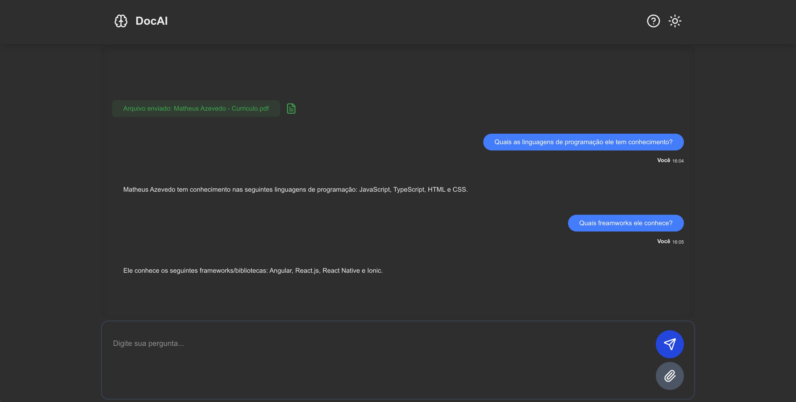
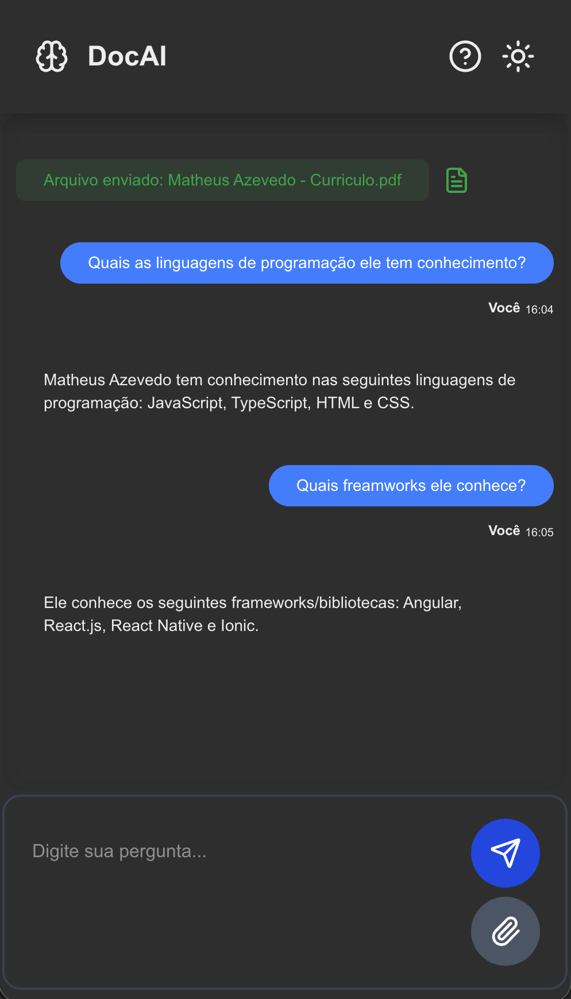

# DocAI


Projeto construido para facilitar a extração de informações de PDFs, principalmente os mais extensos. Basta anexar o PDF e fazer uma pergunta sobre o documento.

## Demonstração

[Visualizar o projeto!](https://assistente-docs.vercel.app/)

<p float="left">
  
  
</p>

## Instalação

```bash
git clone https://github.com/MatheusOliveiraAzevedo/assistente-docs.git
cd assistente-docs
npm install
npm run dev
```

## Instruções de uso

Ao abrir a tela do DocAI, você vera na base da tela um campo de input de texto, e a direita um botão de anexo. 

Clique em ***Anexo***, escolha um arquivo .pdf para que o assistente possa te auxiliar. 

Depois do arquivo carregado, você só precisa escrever uma pergunta sobre o documento no campo de texto e clicar em ***Enviar***, ou pressionar a tecla ***Enter***

Você vera na tela a resposta do assistente escrita no campo logo acima do input de texto, onde as suas perguntas foram registradas.

## Técnologias utilizadas

- React.js
- Next.js
- TypeScript
- Tailwind CSS
- OpenAI API
- Supabase
